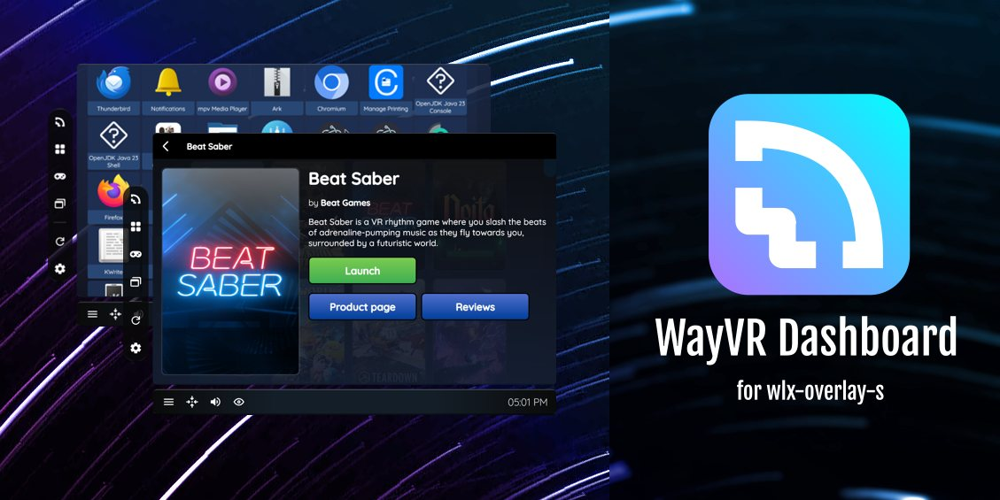

<p align="center">
	
</p>

WayVR Dashboard is a work-in-progress overlay application (WayVR/wlx-overlay-s plugin via IPC) for launching various applications and games directly into a VR desktop environment. It will also offer numerous quality-of-life features to bring Linux VR gaming on par with SteamVR's dashboard. Stay tuned!

### Roadmap

`*` - working on it

| Done |          Variant | Description                                       | Requires |
| ---: | ---------------: | :------------------------------------------------ | -------: |
|   ✔ |              IPC | wlx-overlay-s (wayvr) <-> WayVR dashboard interop |          |
|   ✔ | Applications tab | .desktop Application fetch support                |          |
|   ✔ | Applications tab | .desktop Icon matcher                             |          |
|   ✔ | Applications tab | Applications viewer                               |          |
|      | Applications tab | Search box, sort by categories                    |          |
|   ✔ | Applications tab | Spawn application inside wlx-overlay-s (WayVR)    |      IPC |
|   ✔ | Applications tab | Display manager (select WayVR display)            |      IPC |
|   ✔ |            WayVR | WayVR running applications manager                |      IPC |
|   ✔ |        Games tab | List all installed Steam games                    |          |
|      |        Games tab | Search box, sort by vr/non-vr games               |          |
|   ✔ |        Games tab | Launch desktop games inside WayVR                 |          |
|   ✔ |        Games tab | Fetch cover image of games                        |          |
|   ✔ |        Games tab | Games viewer                                      |          |
|   \* |        Games tab | Launch/stop Steam games                           |          |
|   ✔ |            Utils | Re-center button                                  |      IPC |
|   ✔ |            Utils | Show device battery levels                        |      IPC |
|   \* |            Utils | Microphone/speaker volume control                 |          |
|      |            Utils | Launch index_camera_passthrough                   |          |
|   \* |         Settings | Settings window, session metrics                  |      IPC |
|   ✔ |      Home screen |                                                   |          |

# DISCLAIMER

### This project is still under heavy development and lacks various features that will be implemented in the future. Here is our [Matrix and Discord](https://lvra.gitlab.io/docs/community/).

# Build instructions

Firstly, **read disclaimer above**.

Make sure to have NodeJS/npm, C/C++ compiler and rust installed and everything in between if you get any build issues.

[Rust installation instructions](https://www.rust-lang.org/tools/install)

[NodeJS installation instructions](https://nodejs.org/en/download) (only if you have an ancient distro)

#### 1. Clone this repository build WayVR dashboard:

```bash
git clone --depth=1 https://github.com/olekolek1000/wayvr-dashboard.git
cd wayvr-dashboard
npm install
npm run tauri build
```

Built executable will be available at `./src-tauri/target/release/wayvr_dashboard`.

#### 2. Configure _[wlx-overlay-s](https://github.com/galister/wlx-overlay-s)_

```bash
git clone --depth=1 https://github.com/galister/wlx-overlay-s.git
cd wlx-overlay-s
cargo build
```

#### 3. Add this dashboard to the `wayvr.yaml` file in _wlx-overlay-s_:

Modify `./src/res/wayvr.yaml` file in the _wlx-overlay-s_ repo (you can copy it to the `~/.config/wlxoverlay/wayvr.yaml` path if you want to):

```yaml
dashboard:
  exec: "/home/YOUR_USER/PATH_TO_REPO/wayvr-dashboard/src-tauri/target/release/wayvr_dashboard"
  args: ""
  env: ["GDK_BACKEND=wayland"]
```

⚠️ Modify `exec` path accordingly to your executable path!

#### 3. Start wlx-overlay-s:

```bash
cd wlx-overlay-s
cargo run
```

You are all set! You will see a blue "Dash" button in your watch. You can also assign a controller button to toggle it automatically.

### Have fun!
