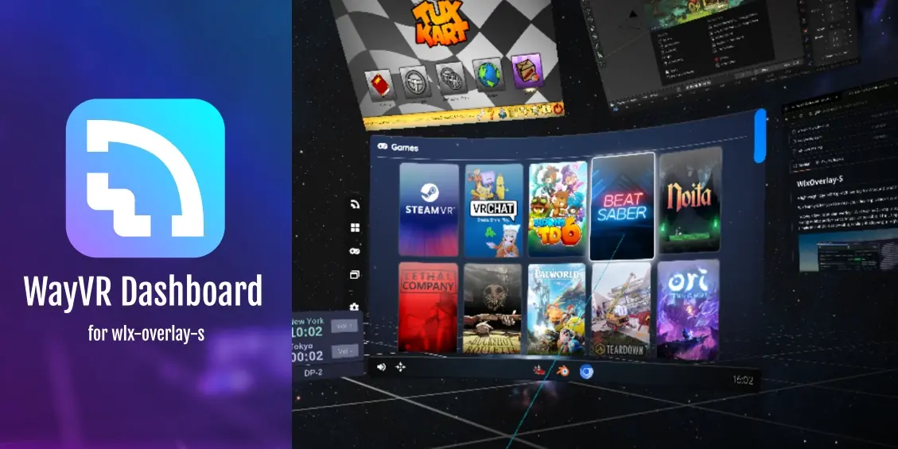
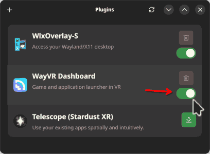

[](https://discord.gg/EHAYe3tTYa) [](https://matrix.to/#/#linux-vr-adventures:matrix.org)

</p>

<p align="center">
	
</p>

WayVR Dashboard is a work-in-progress overlay application (WayVR/wlx-overlay-s plugin via IPC) for launching various applications and games directly into a VR desktop environment.

# Quick setup

## Method 1: Via [Envision](https://gitlab.com/gabmus/envision):

Open "Plugins" and install the newest WayVR Dashboard release:



That's it. No further configuration is required.

## Method 2: Package manager

### Arch Linux:

Package name: `aur/wayvr-dashboard-git`

[https://aur.archlinux.org/packages/wayvr-dashboard-git](https://aur.archlinux.org/packages/wayvr-dashboard-git)

### Homebrew:

```bash
brew tap matrixfurry.com/atomicxr https://tangled.sh/@matrixfurry.com/homebrew-atomicxr
brew install wayvr-dashboard
```

## Method 3: Via [Releases](https://github.com/olekolek1000/wayvr-dashboard/releases) page:

Unzip the newest WayVR Dashboard, and link the AppImage file in the [wayvr.yaml config file](#assigning-wayvr-dashboard-to-the-wayvr-config-in-wlx-overlay-s)

## Method 4: Manual compilation

Make sure to have NodeJS/npm, C/C++ compiler and rust installed and everything in between if you get any build issues.

[Rust installation instructions](https://www.rust-lang.org/tools/install)

[NodeJS installation instructions](https://nodejs.org/en/download) (only if you have an ancient distro)

After compiling, [configure wlx-overlay-s accordingly.](#assigning-wayvr-dashboard-to-the-wayvr-config-in-wlx-overlay-s)

#### 1. Clone this repository build WayVR dashboard:

```bash
git clone --depth=1 https://github.com/olekolek1000/wayvr-dashboard.git
cd wayvr-dashboard
npm install
npm run tauri build
```

Built executable will be available at `./src-tauri/target/release/wayvr-dashboard`.

#### 2. Configure _[wlx-overlay-s](https://github.com/galister/wlx-overlay-s)_

```bash
git clone --depth=1 https://github.com/galister/wlx-overlay-s.git
cd wlx-overlay-s
cargo build
```

## Assigning WayVR Dashboard to the WayVR config in wlx-overlay-s

1. Go to `~/.config/wlxoverlay/wayvr.conf.d` directory and create a file named e.g. `dashboard.yaml` with the following content:

```yaml
dashboard:
  exec: "/home/YOUR_DIR/wayvr-dashboard.AppImage"
  args: ""
  env: []
```

⚠️ Modify `exec` path accordingly to your executable path!

In case if you have it installed from the package manager, you can simply put `"wayvr-dashboard"` to the `exec`.

And now you can start wlx-overlay-s via Envision, or manually:

```bash
cd wlx-overlay-s
cargo run
```

You are all set! You will see a blue "Dash" button in your watch. You can also assign a controller button to toggle it automatically.

### Have fun!
