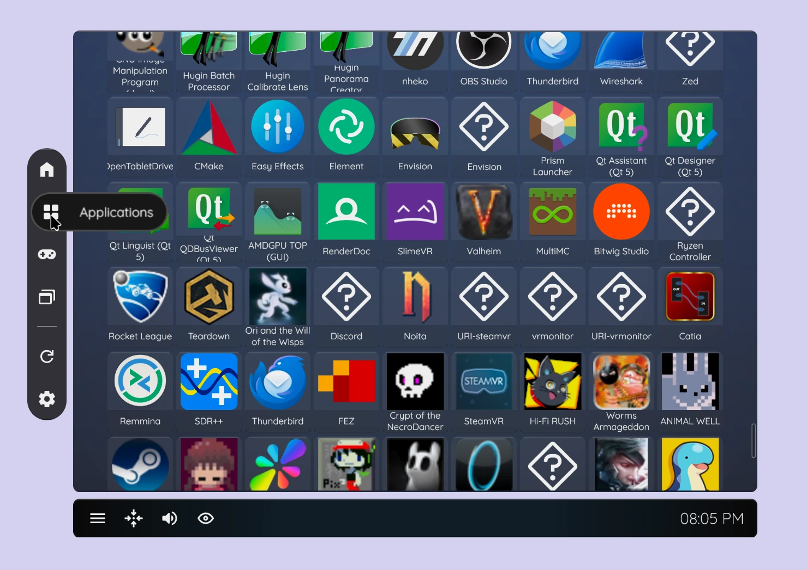

# WayVR Dashboard

<p align="center">
	
</p>

WayVR Dashboard is an work-in-progress overlay application (WayVR/wlx-overlay-s plugin via IPC) for launching various applications and games directly into a VR desktop environment. It will also offer numerous quality-of-life features to bring Linux VR gaming on par with SteamVR dashboard. Stay tuned!

### Roadmap

`*` - working on it

| Done |          Variant | Description                                       | Requires |
| ---: | ---------------: | :------------------------------------------------ | -------: |
|   \* |              IPC | wlx-overlay-s (wayvr) <-> WayVR dashboard interop |          |
|   ✔ | Applications tab | .desktop Application fetch support                |          |
|   ✔ | Applications tab | .desktop Icon matcher                             |          |
|   ✔ | Applications tab | Applications viewer                               |          |
|      | Applications tab | Search box, sort by categories                    |          |
|      | Applications tab | Spawn application inside wlx-overlay-s (WayVR)    |      IPC |
|      | Applications tab | Display manager (select WayVR display)            |      IPC |
|      |            WayVR | WayVR running applications manager                |      IPC |
|   ✔ |        Games tab | List all installed Steam games                    |          |
|      |        Games tab | Search box, sort by vr/non-vr games               |          |
|   ✔ |        Games tab | Launch desktop games inside WayVR                 |          |
|   ✔ |        Games tab | Fetch cover image of games                        |          |
|   ✔ |        Games tab | Games viewer                                      |          |
|   \* |        Games tab | Launch/stop Steam games                           |          |
|      |            Utils | Re-center button                                  |      IPC |
|      |            Utils | Show device battery levels                        |      IPC |
|      |            Utils | Microphone/speaker volume control                 |          |
|      |            Utils | Launch index_camera_passthrough                   |          |
|      |         Settings | Settings window, session metrics                  |          |
|      |      Home screen | TODO                                              |          |

# DISCLAIMER

### This project is still under development and lacks IPC with wlx-overlay-s, so it cannot launch or spawn applications/games. Install it only if you want to contribute to or help develop this dashboard until it is ready for use.

# Build instructions

1. **Read disclaimer above**

2. Make sure to have lld linker, npm, C/C++ compiler and rust installed and everything in between if you get any build issues.

```
npm install
npm run tauri dev
```
